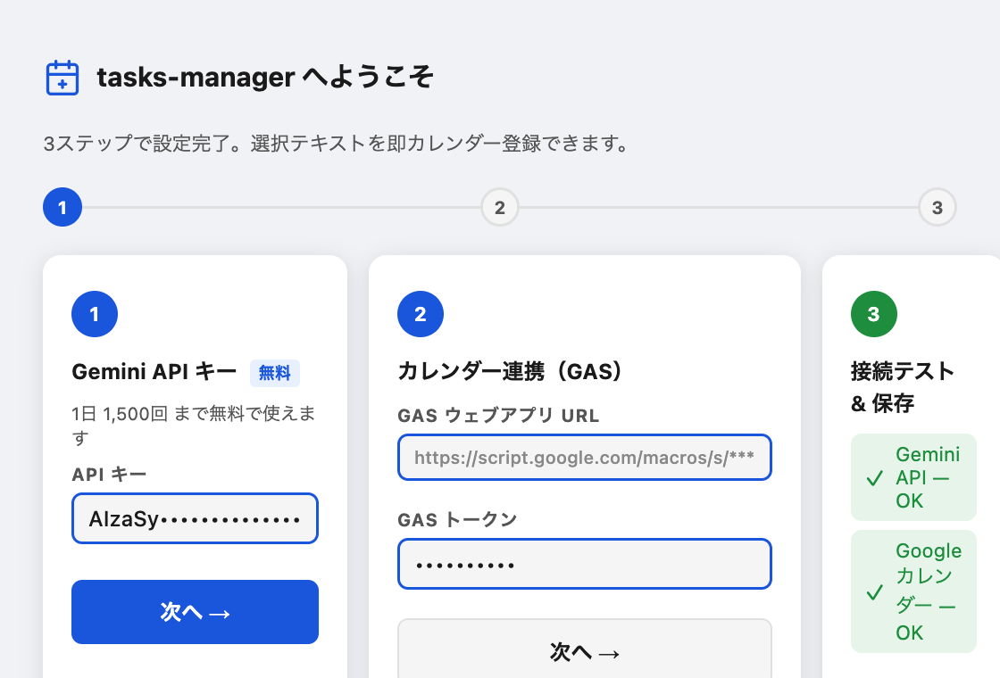
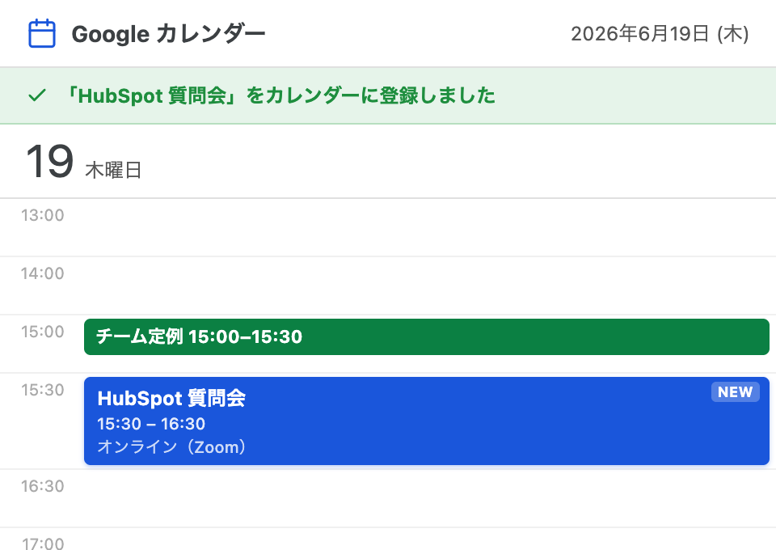

# Quick-calendar — テキスト選択でGoogleカレンダーに即登録

選択したテキストをワンクリックで Google カレンダーに登録。Chrome拡張＋全Macアプリ対応。

**ランディングページ**: https://ryuiyamada.github.io/yotei-tsuika-lp/

---

## これは何ができる?

- **どのアプリでも使える** — Chrome・Slack・LINE・メール・メモ帳など、テキストが表示されているアプリ全てに対応
- **AIが日時・場所・タイトルを自動解析** — 「来週月曜14時 渋谷で打合せ」のような自然な文章から予定を作成
- **ワンクリック登録** — テキストを選択 → ボタンを押す → 確認 → 完了の4ステップ
- **無料枠で1日1,500回** — Gemini API の無料枠で十分に運用可能

---

## 使い方（4ステップ）

### STEP 1 — 初期設定

拡張機能またはクイックアクションをインストールし、API キーとカレンダーを設定する。

---

### STEP 2 — テキストを選択してボタンを押す

予定の情報が含まれたテキストを選択すると「カレンダーに追加」ボタンが表示される。

---

### STEP 3 — 内容を確認・編集

AIが解析した日時・タイトル・場所を確認。必要なら修正してから登録する。

---

### STEP 4 — Googleカレンダーに登録完了

ワンクリックで予定が登録される。

---

## 対応環境

| 方法 | 対応範囲 |
|---|---|
| Chrome拡張 | Chrome上のWebページ（Gmail・Notion・Slackウェブ版など） |
| macOSクイックアクション | Chrome以外のデスクトップアプリ全般（Slack・メモ・メール等） |

---

## セットアップ（導入手順）

### 用意するもの

- Google アカウント（カレンダー）
- **Gemini API キー**（無料）… https://aistudio.google.com/apikey で取得（`AIza…` で始まる）
- Google Chrome（拡張を使う場合）／ Mac（クイックアクションを使う場合）

> 導入は **STEP 1（GAS）→ STEP 2（Chrome拡張）→ STEP 3（Mac・任意）** の順。予定を書き込む係（GAS）が先に必要なので STEP 1 から始める。

---

### STEP 1 — GAS ウェブアプリ（カレンダー書込ブリッジ）を用意

「予定を Google カレンダーに書き込む係」を Google 側に **一度だけ** 設置する。

1. **GASプロジェクトを新規作成**  
   https://script.google.com を開き、「新しいプロジェクト」をクリック。

2. **コードを貼り付け**  
   エディタ内の既存コードをすべて削除し、このリポジトリの `gas/Code.gs` の内容をコピー＆ペースト。  
   任意で `gas/appsscript.json` のタイムゾーン設定も反映できる。

3. **スクリプトプロパティを設定**  
   「プロジェクトの設定（⚙️）」→「スクリプトプロパティ」で以下を追加。

   | プロパティ | 必須 | 説明 |
   |---|---|---|
   | `API_TOKEN` | **必須** | 好きな合言葉。STEP 2 で入れる「GASトークン」と同じ値にする。生成例: `openssl rand -hex 32` |
   | `CAL_PERSONAL` | 任意 | `personal` 用カレンダーID。未設定なら主（デフォルト）カレンダーに登録 |
   | `CAL_WORK` | 任意 | `work` 用カレンダーID。未設定なら主カレンダーに登録 |
   | `CAL_<KEY>` | 任意 | 任意キー用カレンダーID（例: `CAL_FAMILY`）。未設定なら主カレンダー |

   > カレンダーIDの取得: Google カレンダー → 設定 → カレンダーの統合 → 「カレンダーID」  
   > **カレンダーIDの差し替えはコード編集不要。** スクリプトプロパティを更新するだけで反映される。

4. **デプロイ**  
   「デプロイ」→「新しいデプロイ」→ 種類 = **ウェブアプリ** / 実行ユーザー = **自分** / アクセス = **全員** → 「デプロイ」。  
   発行された **ウェブアプリURL** をコピー（STEP 2 で使う）。

詳細: [gas/README.md](gas/README.md)

---

### STEP 2 — Chrome拡張をインストール

1. このリポジトリを **Download ZIP**（緑の「Code」ボタン → Download ZIP）して解凍（または `git clone`）
2. Chrome で `chrome://extensions` を開く → 右上「**デベロッパーモード**」を ON
3. 「**パッケージ化されていない拡張機能を読み込む**」→ 解凍した中の **`chrome-extension`** フォルダを選択
4. 拡張のアイコン → オプション画面で次の3つを入力して保存：
   - **Gemini API キー**
   - **GASウェブアプリURL**（STEP 1 でコピーしたもの）
   - **GASトークン**（= STEP 1 の `API_TOKEN` と同じ値）

詳細: [chrome-extension/README.md](chrome-extension/README.md)

---

### STEP 3 — macOSクイックアクション（任意）

Chrome以外のアプリ（Slack / メモ / メール等）でも使いたい場合のみ。

1. `desktop-quickaction/README.md` の手順に沿って Automator にクイックアクションとして登録
2. 同じ **Gemini キー・GAS URL・トークン** を設定

詳細: [desktop-quickaction/README.md](desktop-quickaction/README.md)

> **注意**: Gemini API キー・カレンダーは各自「自分のもの」を設定する必要があります（他人のカレンダーには書き込めません）。

---

### 使い方

予定を含むテキストを **選択 → 右クリック「予定を追加」**（Mac版はショートカット）→ AIが日時・場所・タイトルを解析 → 確認・編集 → カレンダー登録完了。

---

## 技術スタック

- Gemini API（自然言語解析）
- Google Calendar API
- Chrome Extensions Manifest V3
- macOS Automator / Quick Actions

## ライセンス

MIT
