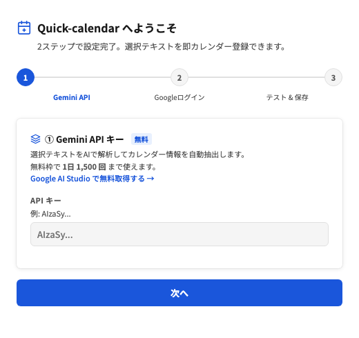
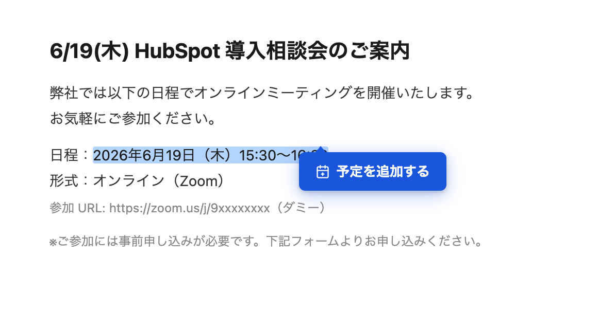
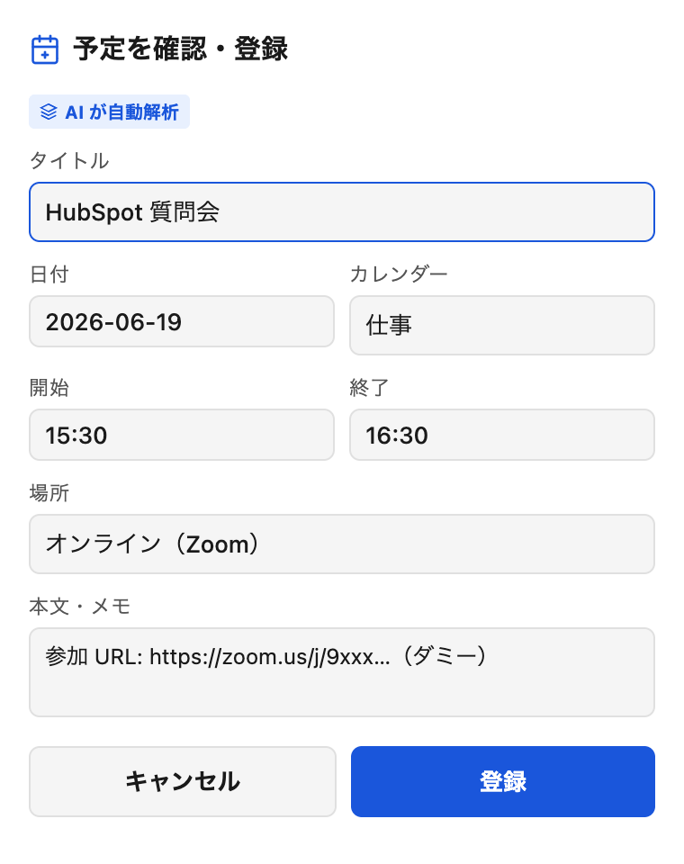

# Quick-calendar — テキスト選択でGoogleカレンダーに即登録

選択したテキストをワンクリックで Google カレンダーに登録。Chrome拡張＋全Macアプリ対応。

**ランディングページ**: https://ryuiyamada.github.io/quick-calendar/

---

## これは何ができる?

- **どのアプリでも使える** — Chrome・Slack・LINE・メール・メモ帳など、テキストが表示されているアプリ全てに対応
- **AIが日時・場所・タイトルを自動解析** — 「来週月曜14時 渋谷で打合せ」のような自然な文章から予定を作成
- **ワンクリック登録** — テキストを選択 → ボタンを押す → 確認 → 完了
- **GAS不要** — Googleでログインするだけ。Google Apps Scriptの設定は不要
- **無料枠で1日1,500回** — Gemini API の無料枠で十分に運用可能

---

## 使い方（4ステップ）

### STEP 1 — 初期設定（2ステップ・初回のみ）

拡張機能をインストールし、ウィザードで2つの設定を完了する。

① Gemini APIキーを入力（無料取得）  
② Googleでログイン（OAuthでカレンダーアクセスを許可）

---

### STEP 2 — テキストを選択してボタンを押す

予定の情報が含まれたテキストを選択すると「カレンダーに追加」ボタンが表示される。

---

### STEP 3 — 内容を確認・編集

AIが解析した日時・タイトル・場所を確認。必要なら修正してから登録する。

---

### STEP 4 — Googleカレンダーに登録完了

ワンクリックで予定が登録される。

---

## 対応環境

| 方法 | 対応範囲 |
|---|---|
| Chrome拡張 | Chrome上のWebページ（Gmail・Notion・Slackウェブ版など） |
| macOSクイックアクション | Chrome以外のデスクトップアプリ全般（Slack・メモ・メール等） |

---

## インストール

### 方法 A — ZIP をダウンロード（簡単・推奨）

1. [Releases](https://github.com/RYUIYAMADA/quick-calendar/releases) から **`quick-calendar-extension.zip`** をダウンロード
2. ZIP を解凍する（`quick-calendar-extension` フォルダが作成される）
3. Chrome で `chrome://extensions/` を開く
4. 右上の **「デベロッパーモード」をオン**にする
5. **「パッケージ化されていない拡張機能を読み込む」** をクリック
6. 解凍してできたフォルダを選択
7. 初回起動で設定ウィザードが開くので、**Gemini APIキーを入力**し、**Googleでログイン**する

### 方法 B — リポジトリをダウンロードした場合

> **重要**: `quick-calendar-main`（リポのルートフォルダ）ではなく、その中の **`chrome-extension` フォルダ** を読み込んでください。ルートには `manifest.json` がないためエラーになります。

1. リポジトリを ZIP でダウンロード → 解凍
2. Chrome で `chrome://extensions/` を開く
3. 右上の **「デベロッパーモード」をオン**にする
4. **「パッケージ化されていない拡張機能を読み込む」** をクリック
5. 解凍したフォルダの中の **`chrome-extension`** フォルダを選択
6. 初回起動で設定ウィザードが開くので、**Gemini APIキーを入力**し、**Googleでログイン**する

### macOSクイックアクション

詳細: [mac-quick-action/README.md](mac-quick-action/README.md)

> **注意**: Gemini API Key と使用するカレンダーはそれぞれ自分のものを設定する必要があります。

---

## セットアップ手順まとめ

1. 拡張を読み込む（方法A または B）
2. Gemini API キーを入力（[Google AI Studio](https://aistudio.google.com/apikey) で無料取得）
3. Googleでログイン（OAuth — GASの設定不要）

> **テストユーザー制限について**: 現在 Google OAuth同意画面はテストモードです。追加したテストユーザーのみ利用可能です。広く配布するには Googleの公開申請（OAuth審査）が必要です。

---

## 技術スタック

- Gemini API（自然言語解析）
- Google Calendar API（OAuth 2.0 / Chrome Identity API）
- Chrome Extensions Manifest V3

## ライセンス

MIT
